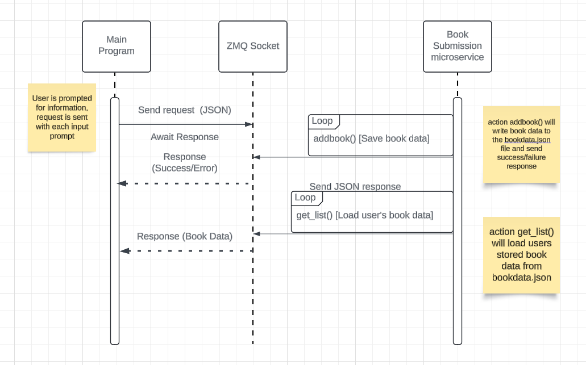

Book submission Microservice
This Microservice uses a REQ-Reply ZMQ pattern to allow users to add and view their book collection. 
Book data is stored in bookdata.json.
Communication Pipe: ZMQ request/reply sockets
Currently running on local port 5555

            Actions:
'submit_books' to submit new books
'get_list' to get titles in user's data.

         Communication Contract
                        

Requesting Data:  

To request data, send a JSON request via ZMQ including the action and the username.
submit_books() will allow user to submit new books to their collection.

Submit_books() will allow user to submit new books to their collection, including title, Author, URL, and description.
Example JSON request to submit new books:

-Import zmq

Context = zmq.context()
Socket = context.socket(zmq.REQ)
socket.connect(“tcp://localhost:5555”)

Request = { 
‘Action’: ‘submit_books’,
‘Username’: ‘SoandSo’
‘Books’: [
{‘title: ‘Book1’, ‘author’: ‘Author1’,’url’:’http://url1’,’description’:’Description1’}
]
}

socket.send_json(request)
response = socket.recv_json()
 	print(response)

            
get_list() will return a list of book titles in the user’s collection.
Example JSON request to view user’s books. :

-Import zmq

Context = zmq.context()
Socket = context.socket(zmq.REQ)
socket.connect(“tcp://localhost:5555”)

Request = { 
‘Action’: ‘get_list’,
‘Username’: ‘SoandSo’
}

	socket.send_json(request)
response = socket.recv_json()
 	print(response)

Receiving Data:

The microservice will send back a JSON response via the ZMQ socket. The response will include a status as well as the message response. Get_list will return a list of the titles within the user’s collection.

Submit_books response:
			{
			“Status”: “success”,
			“Message”: “Book(s) added successfully!”
}

Get_list response: 

			{ 
			“Status”: “success”,
			“Books”: [
			{“Book1”, “Book2”}
				]
			}

             References:
'Extend' Function usage referenced: https://www.geeksforgeeks.org/append-extend-python/
ZMQ usage referenced:
 Flores, Luis. Introduction to ZeroMQ. 11 June 2024.
 Req-Reply https://zguide.zeromq.org/docs/chapter1/#Ask-and-Ye-Shall-Receive

UML Diagram:
 